# seichi-portal-frontend

このリポジトリは、Seichi Portalのフロントエンド実装です。

プロジェクトの目的やバックエンドなどの関連リポジトリについては、[こちらのリポジトリ](https://github.com/GiganticMinecraft/seichi-portal)を参照してください。

## 機能・ページ説明

| ページアドレス | 説明                               |
| -------------- | ---------------------------------- |
| `/`            | 各ページの一覧を表示する           |
| `/forms`       | 回答可能なフォームの一覧を表示する |
| `/forms/[id]`  | 各フォームに回答する               |

また、各ユーザーのログイン・ログアウトに、[Microsoftアカウント](https://account.microsoft.com/account?lang=ja-jp)を使用しています。したがって、Minecraftのアカウント情報が紐付けられたアカウントが必要です。

## API定義

Seichi Portalではフロントエンドとバックエンド間の通信に REST APIを使っています。詳細については、[seicihi-portal-backend](https://github.com/GiganticMinecraft/seichi-portal-backend)および[seichi-api-schema](https://github.com/GiganticMinecraft/seichi-api-schema)を参照してください。

## 開発環境とミドルウェア

フロントエンドの実装にはNode.jsとTypeScript、フレームワークにはNext.jsを採用しています。

また、テストにJest、StorybookおよびReact Testing Library、リンターにESLintとPrettierを使用しています。

その他開発環境の準備や手順の詳細については、[CONTRIBUTING.md](./CONTRIBUTING.md)を参照してください。

## 本番環境

`main`ブランチに更新があると、[GitHub Actionsがビルドを行い](./.github/workflows/ci-and-cd.yml)、[GitHub Pages](https://portal.seichi.click/)にデプロイを行います。

## プロジェクト俯瞰図

## ライセンス

[Apache Licence 2.0](https://github.com/GiganticMinecraft/seichi-portal-frontend/blob/main/LICENSE)
